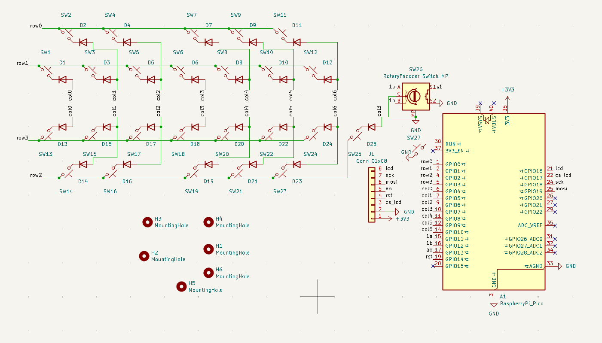
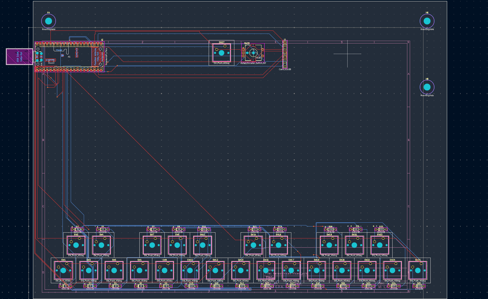
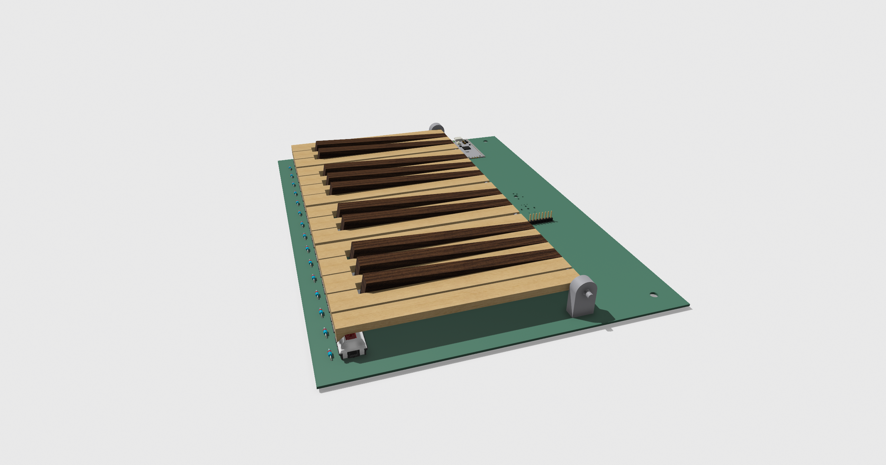
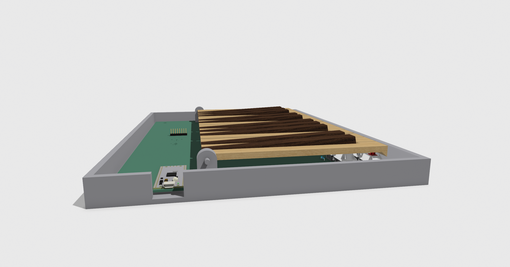
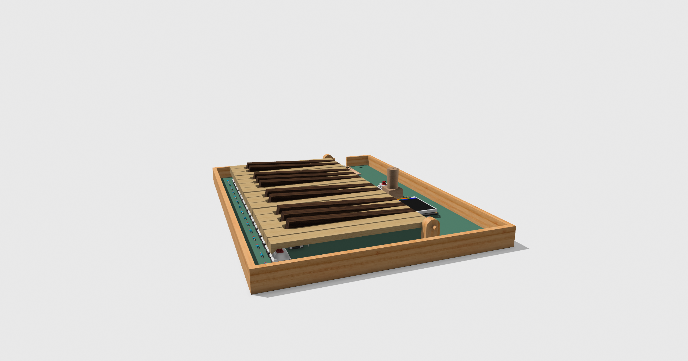
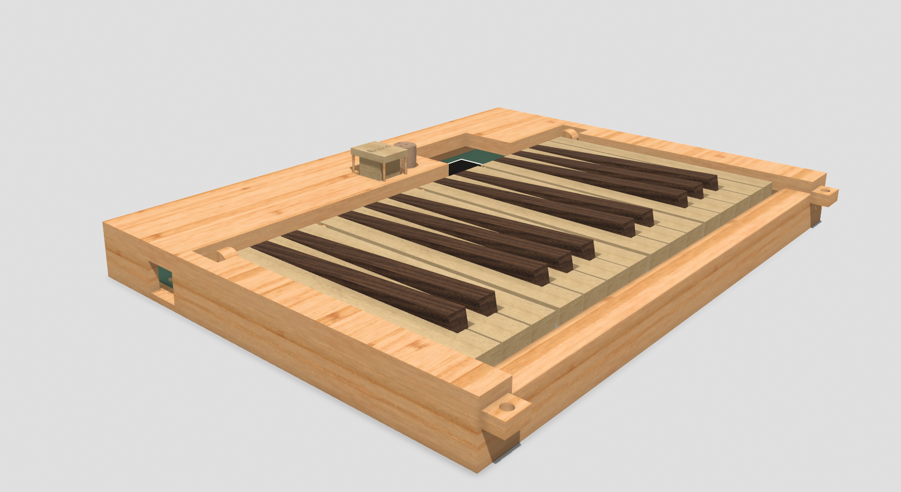

# Kaino (or Kiano)

## What this project is

Here's a short story about this project! I wanted a keyboard from Casio, but it was too expensive for me, so I made my own. I just made a keyboard which should theoretically be able to connect to my computer, and use LMMS that's on my computer, to play sounds that sound exactly like a real piano! 

## How I made it

I made the schematic and PCB in Kicad, which is my prefered software for this type of stuff. I used Shapr3D on my Ipad for the model of the case. I also used Shapr3D's "Visualize" feature for the renders that I got. I plan to use Cherry MX mechanical keyswitches, which are what I have on my pcb renders. I have made my own custom keycap in Shapr3D, which is what I plan to print out and use. Not only does it look like a piano, it feels like one, too. I have put a hole in all of the piano keycaps, and made them a hinge. Whenever you press on a key, it will have the same rotational movement as a really key has. Obviously, I'm limited with the materials of the keycaps that I produce, as I don't have access to the premium ceramic keys that the real pianos have. In addition, even if I did have access to them, the mechanical keyswitches that I'm using wouldn't be able to support the weight of them, at least without substantial springing. My banner image for it is AI Generated, just a disclaimer, hope that it doesn't cause any issues.

## Schematic

## PCB

## Render #1

## Render #2

## Render #3

## Render #4

## BOM
| Item                  | Description              | Quantity           | Unit Price | Total Price | Total (with tax & shipping incl.) | Running Total                                                               | Link                                                                                                                                                                                                                                                                                                                                                                                                                                                                                                                                                                                   |   |   |   |   |                                                                                            |
|-----------------------|--------------------------|--------------------|------------|-------------|-----------------------------------|-----------------------------------------------------------------------------|----------------------------------------------------------------------------------------------------------------------------------------------------------------------------------------------------------------------------------------------------------------------------------------------------------------------------------------------------------------------------------------------------------------------------------------------------------------------------------------------------------------------------------------------------------------------------------------|---|---|---|---|--------------------------------------------------------------------------------------------|
| PCB                   | PCB from jlcpcb          | 5 (jlcpcb minimum) | $0.00      | $0.00       | $0.00                             | $0.00                                                                       | https://cart.jlcpcb.com/quote                                                                                                                                                                                                                                                                                                                                                                                                                                                                                                                                                          |   |   |   |   |                                                                                            |
| Cherry MX switches    | Cherry MX Switches       | 1                  | $0.00      | $0.00       | $0.00                             | $0.00                                                                       | https://www.amazon.com/OUTEMU-Red-Switches-Pin-Switch/dp/B095W1QYPJ/ref=sr_1_10?crid=5KMUPYD6IZAA&dib=eyJ2IjoiMSJ9.ii8hn-4PoCBy9_AF64n2EIdF-8TcQv4n4fZUgrf6eaJl_2E7NqmhJTi7zDvZldSbW1GBUyXt96vEE5SZ91GLxMlmPeL0GdI5OqmHLtCsKP6S4yFXbT0PFL_AmCCw-UflwuoJvqH2WNDOXLrnCfIFiWIC3DsUp4Nng1ZPkXDfcNJ9YehwtTPZZKEcRtRQIGpqlk5xy1gLdXWIZ-g9Wlaw73lw5D9hfxBtmo1eMZbXho8.vcyENYYKR-iks1sqvfSt9besUzxZzQDz3KBChHqnxDw&dib_tag=se&keywords=cherry%2Bmx%2Bswitches%2B5%2Bpin&qid=1777429869&sbo=RZvfv%2F%2FHxDF%2BO5021pAnSA%3D%3D&sprefix=cherry%2Bmx%2Bswitches%2B5%2Bpi%2Caps%2C216&sr=8-10&th=1 |   |   |   |   |                                                                                            |
| Raspberry Pi pico     | MCU                      | NA                 | $0.00      | $0.00       | $0.00                             | $0.00                                                                       | https://www.amazon.com/gp/product/B0C6Q67V97?smid=A1YZW40LYQY3L1&psc=1                                                                                                                                                                                                                                                                                                                                                                                                                                                                                                                 |   |   |   |   | Since I already have plenty of these in my house, I decided to put $0, but included a link |
| 1N4148W (100pcs)      | Diodes                   | 1                  | $0.00      | $0.00       | $0                                | $0.00                                                                       | https://www.aliexpress.us/item/3256807716771073.html?spm=a2g0o.cart.0.0.47a538daYBbt9U&mp=1&pdp_npi=5%40dis%21USD%21USD%201.48%21USD%201.48%21%21USD%201.48%21%21%21%40210328db17669560346357255e1c7d%2112000042781108223%21ct%21US%216953170698%21%211%210&gatewayAdapt=glo2usa                                                                                                                                                                                                                                                                                                       |   |   |   |   |                                                                                            |
| 3D Prints             | 3D printed keys and case | NA                 | $0         | $0          | My own printer                    | $0                                                                          | NA                                                                                                                                                                                                                                                                                                                                                                                                                                                                                                                                                                                     |   |   |   |   |                                                                                            |
| Rotary Encoder (5pcs) | EC11 rotary encoder      | 1                  | $0.00      | $0.00       | $0                                | $0.00                                                                       | https://www.amazon.com/gp/product/B0C6Q67V97?smid=A1YZW40LYQY3L1&psc=1                                                                                                                                                                                                                                                                                                                                                                                                                                                                                                                 |   |   |   |   | I already have some of these lying around from hackpad a long time ago                     |
| Adafruit 1.8 TFT      | LCD Display              | 1                  | $0.00      | $0.00       | $0.00                             | $0.00                                                                       | https://www.adafruit.com/product/358                                                                                                                                                                                                                                                                                                                                                                                                                                                                                                                                                   |   |   |   |   |                                                                                            |
|                |                          |                    |            |             |                                   | Running total is 0 because I'm paying for all costs related to buying parts |                                                                                                                                                                                                                                                                                                                                                                                                                                                                                                                                                                                        |   |   |   |   |                                                                                            |

The total amount of money that I would have to spend would be $72.18, since I'm buying parts myself